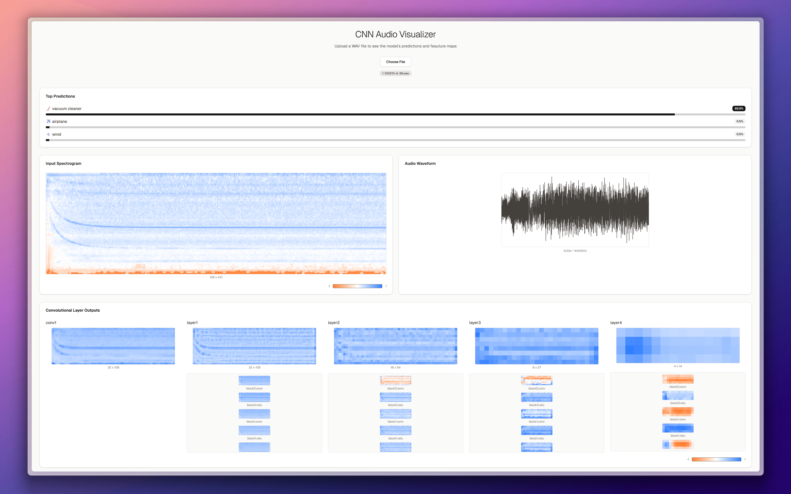

<div align="center">

# 🎵 Audio Classification CNN

**Deep Learning Audio Classification with Interactive Visualization**



[](https://www.python.org/downloads/)
[](https://modal.com/)
[](https://nextjs.org/)
[](https://tensorflow.org/)
[](LICENSE.MD)

*A state-of-the-art deep learning system for audio classification featuring ResNet-style CNN architecture, real-time inference, and interactive visualization dashboard.*

</div>

---

## Features:

- 🧠 Deep Audio CNN for sound classification
- 🧱 ResNet-style architecture with residual blocks
- 🎼 Mel Spectrogram audio-to-image conversion
- 🎛️ Data augmentation with Mixup & Time/Frequency Masking
- ⚡ Serverless GPU inference with Modal
- 📊 Interactive Next.js & React dashboard
- 👁️ Visualization of internal CNN feature maps
- 📈 Real-time audio classification with confidence scores
- 🌊 Waveform and Spectrogram visualization
- 🚀 FastAPI inference endpoint
- ⚙️ Optimized training with AdamW & OneCycleLR scheduler
- 📈 TensorBoard integration for training analysis
- 🛡️ Batch Normalization for stable & fast training
- 🎨 Modern UI with Tailwind CSS & Shadcn UI
- ✅ Pydantic data validation for robust API requests

## 🚀 Quick Start

### Prerequisites

- Python 3.12+
- Node.js 18+
- Modal account (for serverless deployment)

### Clone the Repository

```bash
git clone https://github.com/your-username/audio-classification.git
cd audio-classification
```

### 🐍 Backend Setup

1. **Create a virtual environment:**
   ```bash
   python -m venv venv
   
   # Windows
   venv\Scripts\activate
   
   # macOS/Linux
   source venv/bin/activate
   ```

2. **Install dependencies:**
   ```bash
   pip install -r requirements.txt
   ```

3. **Setup Modal:**
   ```bash
   modal setup
   ```

4. **Run locally:**
   ```bash
   python train.py  # Train the model
   modal run main.py  # Run inference
   ```

5. **Deploy to Modal:**
   ```bash
   modal deploy main.py
   ```

### 🎨 Frontend Setup

1. **Navigate to frontend directory:**
   ```bash
   cd audio-cnn-visualisation
   ```

2. **Install dependencies:**
   ```bash
   npm install
   # or
   pnpm install
   ```

3. **Run development server:**
   ```bash
   npm run dev
   # or
   pnpm dev
   ```

4. **Open browser:**
   Visit [http://localhost:3000](http://localhost:3000)

## 📁 Project Structure

```
audio-classification/
├── 📂 audio-cnn-visualisation/    # Next.js frontend
│   ├── 📂 src/
│   │   ├── 📂 app/                # App router pages
│   │   ├── 📂 components/         # React components
│   │   └── 📂 lib/                # Utilities
│   └── 📂 public/                 # Static assets
├── 📂 tensorboard_logs/           # Training logs
├── 🐍 main.py                     # Modal inference endpoint
├── 🐍 model.py                    # CNN architecture
├── 🐍 train.py                    # Training script
├── 📋 requirements.txt            # Python dependencies
└── 📖 README.md                   # This file
```

## 🏗️ Architecture

The system consists of three main components:

1. **CNN Model** (`model.py`): ResNet-style architecture optimized for audio spectrograms
2. **Training Pipeline** (`train.py`): Data augmentation, optimization, and model training
3. **Inference API** (`main.py`): Modal-based serverless deployment with FastAPI
4. **Visualization Dashboard**: Interactive React app for real-time classification and feature visualization

## 📊 Dataset

This project uses the **ESC-50** (Environmental Sound Classification) dataset for training and evaluation.

### About ESC-50

The ESC-50 dataset is a labeled collection of 2000 environmental audio recordings suitable for benchmarking methods of environmental sound classification. The dataset consists of 5-second-long recordings organized into 50 semantic classes (with 40 examples per class) drawn from 5 major categories:

- **🐾 Animals**: Dog, Rooster, Pig, Cow, Frog, Cat, Hen, Insects, Sheep, Crow
- **🏞️ Natural soundscapes & water sounds**: Rain, Sea waves, Crackling fire, Crickets, Chirping birds, Water drops, Wind, Pouring water, Toilet flush, Thunderstorm
- **👥 Human, non-speech sounds**: Baby crying, Sneezing, Clapping, Breathing, Coughing, Footsteps, Laughing, Brushing teeth, Snoring, Drinking/sipping
- **🏠 Interior/domestic sounds**: Door knock, Mouse click, Keyboard typing, Door/wood creaks, Can opening, Washing machine, Vacuum cleaner, Clock alarm, Clock tick, Glass breaking
- **🌆 Exterior/urban noises**: Helicopter, Chainsaw, Siren, Car horn, Engine, Train, Church bells, Airplane, Fireworks, Hand saw

### Dataset Features

- **2,000 audio recordings** (40 per class)
- **50 environmental sound classes**
- **5-second duration** per recording
- **44.1 kHz sampling rate**
- **Pre-arranged 5-fold cross-validation**
- **Creative Commons licensed**

### Citation

If you use this dataset in your research, please cite:

```bibtex
@dataset{piczak2015dataset,
  author = {Karol J. Piczak},
  title = {{ESC}: {Dataset} for {Environmental} {Sound} {Classification}},
  url = {https://github.com/karolpiczak/ESC-50},
  year = {2015}
}
```

### Download

You can download the ESC-50 dataset from the official repository:
[https://github.com/karolpiczak/ESC-50](https://github.com/karolpiczak/ESC-50)

## 🎯 Usage

1. **Upload an audio file** through the web interface
2. **View real-time classification** results with confidence scores
3. **Explore feature maps** to understand model decision-making
4. **Analyze waveforms and spectrograms** for deeper insights

## 📄 License

This project is licensed under the MIT License - see the [LICENSE.MD](LICENSE.MD) file for details.

## 🙏 Acknowledgments

- Built with [Modal](https://modal.com/) for serverless GPU inference
- UI components from [Shadcn/ui](https://ui.shadcn.com/)
- Powered by [TensorFlow](https://tensorflow.org/) and [Next.js](https://nextjs.org/)

---

